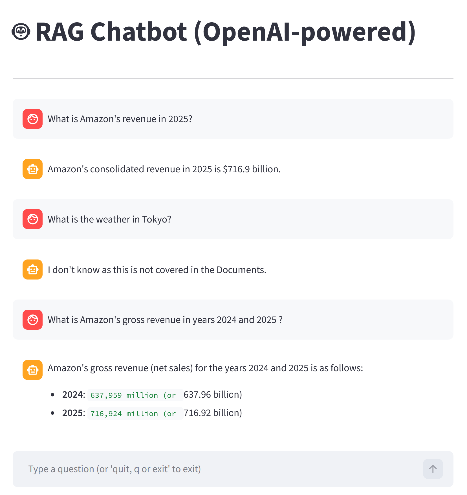

# RAG (Retrieval-Augmented Generation) from PDF documents with Oracle Database

RAG Application in Python using LangChain, LangGraph, OpenAI and Oracle Database 26ai

## Prerequisites

- The application is configured with [Oracle AI Database 26ai Free VirtualBox Appliance](https://www.oracle.com/database/technologies/databaseappdev-vm.html). Alternatively Oracle provides many [Oracle AI Database 26ai Free Platforms](https://www.oracle.com/europe/database/free/get-started/) to chose from.

- [Anaconda](https://www.anaconda.com/download) must be downloaded and installed

## Project Setup

Once Anaconda is installed, download all folders and fields to create the project structure:

```
ragproject/
│
├── config/.env
│
├── data/
│   └── pdfs/
│
├── notebooks/
│   ├── manage_embeddings.ipynb
│   └── rag_chatbot.ipynb 
│
├── scripts/
│   ├── manage_embeddings.py
│   └── rag_chatbot.py
│
├── environment.yml
├── run_manage_embeddings.bat
├── run_rag_chatbot.bat
└── README.md
```

```bash
# Create the environment:

conda env create -f environment.yml

# Activate the environment:

conda activate ragproject
```

## Database Setup

A schema needs to be created in the database. The application will connect to the schema and use the designated table in the .env file to manage the embeddings.

## OpenAI models

To access OpenAI models you’ll need to create an OpenAI account and get an API key. Head to [platform.openai.com](https://platform.openai.com/home) to sign up to OpenAI and generate an API key.

## Configuration

The config/.env file should contain the following environment variables :
```bash
OPENAI_API_KEY= your-api-key
USER= the database user
PASSWORD= the database user’s password
CONNECT_STRING= the connection string to Oracle database
ORACLE_TABLE_NAME= The name of Oracle table that stores the embeddings
PDF_DATA_DIR= ../data/pdfs # the folder where the pdf documents are stored used by the bot to answer questions
EMBEDDING_MODEL= The OpenAI embedding model of your choice
EMBEDDING_DIMENSION= the embedding model dimensions (length of numerical vector)
CHUNK_SIZE= the chunk size
CHUNK_OVERLAP= the chunk overlap
OPENAI_MODEL_NAME= The OpenAi model name 
```

The application is configured with:
```bash
EMBEDDING_MODEL= text-embedding-3-small
EMBEDDING_DIMENSION= 1536
CHUNK_SIZE= 1200
CHUNK_OVERLAP= 200
OPENAI_MODEL_NAME= gpt-4o-mini
```

## Usage

The full code is in the two Jupyter notebooks:
- manage_embeddings.ipynb
- rag_chatbot.ipynb

Any modification will update the corresponding .py scripts under the scripts folder:
- manage_embeddings.py
- rag_chatbot.py

\.bat files :
- run_manage_embeddings.bat
- run_rag_chatbot.bat

run the .py scripts

run_rag_chatbot.bat will activate Streamlit and the user can interact with the chatbot in the browser:



## Context

The RAG chatbot system message defines the AI's role as "a helpful professional financial analyst" whose answers are constrained by the provided documents.

The current documents under /data/pdfs are Amazon's annual and quarterly reports for years 2023-2025.

The application detects changes in the .pdf files by computing the "last updated" timestamp, the file size and a hash of normalized whitespace.

This acts as a prefilter by ignoring files that haven´t been touched and is efficient when a large number of files need to be processed.

The calculated values for each .pdf are saved into a .json file updated during each run in directory /data/pdfs
